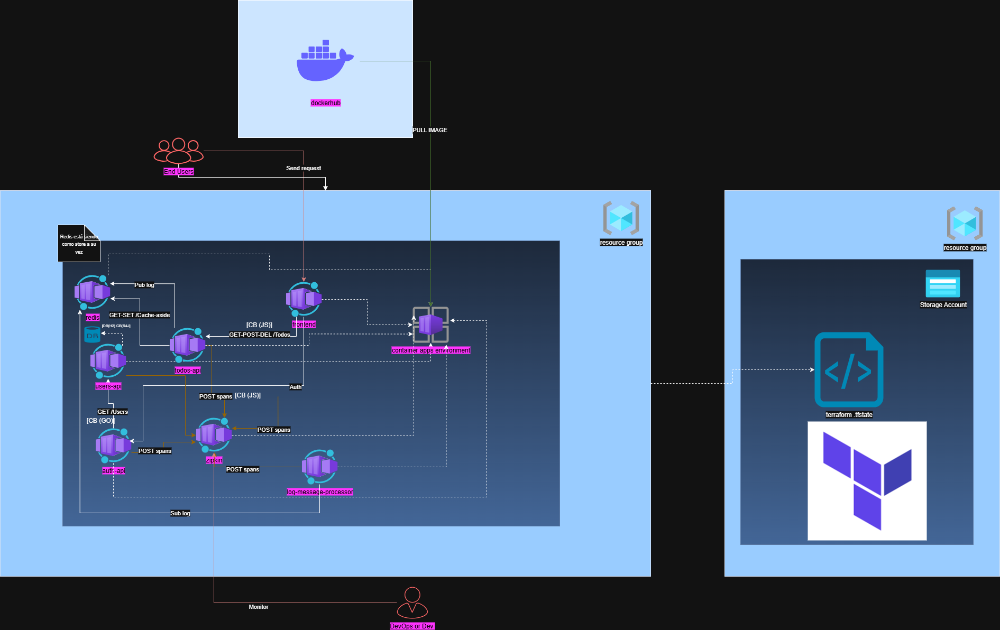

# Architecture Diagram & Design Summary

> Diagrama: `finalDiagram.png` (vista lógica desplegada en Azure Container Apps Environment con énfasis en Cache-Aside, Circuit Breakers, tracing y flujo de eventos).

---

## 1. Alcance y Objetivo

La solución implementa una aplicación TODO distribuida con autenticación y perfiles de usuario. El diagrama refleja:

- Despliegue de cada microservicio como contenedor independiente.
- Separación de responsabilidades (auth, usuarios, todos, logging, frontend).
- Observabilidad (tracing distribuido) y resiliencia (circuit breakers + cache-aside).
- Redis actuando hoy como data store operativo para TODOs y como canal Pub/Sub.

---

## 2. Decisiones Principales de Diseño

| Decisión                                          | Motivación                                                            | Impacto                                                                        |
| ------------------------------------------------- | --------------------------------------------------------------------- | ------------------------------------------------------------------------------ |
| Microservicios independientes                     | Aislar dominios (auth, users, todos, logging, UI)                     | Escalado y ciclos de despliegue separados                                      |
| Azure Container Apps como plataforma de ejecución | Despliegue serverless de contenedores sin gestionar orquestador (K8s) | Auto‐scale granular, menos sobrecarga operativa, integración con logs/ingress  |
| JWT stateless en vez de sesiones                  | Simplificar escalado horizontal                                       | Cada servicio valida token sin estado compartido                               |
| Redis interno como store + cola                   | Rapidez inicial y simplicidad                                         | Pendiente migrar a DB persistente real para TODOs                              |
| Patrón Cache-Aside para TODOs                     | Reducir latencia y evitar recomputar lista inicial                    | Estructura en Redis: `{items, lastInsertedID}`                                 |
| Circuit Breakers en capas (frontend, auth, users) | Evitar fallas en cascada y mejorar tolerancia                         | Fallbacks controlados en cada capa                                             |
| Tracing distribuido (Zipkin)                      | Correlación extremo a extremo                                         | Facilita troubleshooting de latencia y fallos                                  |
| Pub/Sub para logs de operaciones                  | Desacoplar escritura de eventos del request principal                 | Procesamiento asíncrono en [`log-message-processor`](../log-message-processor) |
| Externalización de configuración vía env vars     | 12-Factor                                                             | Portabilidad entre entornos                                                    |

---

## 3. Patrones Clave Añadidos / Destacados

### 3.0 Plataforma de Ejecución: Azure Container Apps

Elegida para el despliegue destino por:

- Abstracción de Kubernetes (sin manejar control plane ni nodos).
- Escalado automático por revisiones y réplicas mínimas (ideal servicios pequeños heterogéneos).
- Ingress HTTP gestionado + revisión por versión (facilita rollbacks rápidos).
- Integración con logging centralizado y métricas sin wiring manual excesivo.
- Coste operativo bajo para entorno de entrenamiento.

Implicaciones:

- Cada microservicio se empaqueta como imagen y se publica; Container Apps gestiona réplicas.
- Posible añadir escalado basado en eventos (KEDA) futuro (e.g., volumen de mensajes Redis si se externaliza a un broker soportado).
- Simplifica transición posterior a AKS si se requiere control más fino, preservando la estructura de imágenes.

### 3.1 Cache-Aside (Lectura/Escritura de TODOs)

Implementado en:

- Controlador: [`TodoController`](../todos-api/todoController.js)
- Servicio de caché: [`CacheAsideService`](../todos-api/cache-aside-service.js)

Flujo lectura (`GET /todos`):

1. [`TodoController.list`](../todos-api/todoController.js) solicita a [`CacheAsideService.get`](../todos-api/cache-aside-service.js).
2. HIT → retorna JSON desde Redis.
3. MISS → genera defaults (`_getDefaultTodoData`) y los guarda (write-back inmediato).

Flujo creación / borrado:

1. Recupera estructura actual (garantiza forma válida).
2. Mutación in-memory.
3. Persistencia inmediata con [`_updateCacheData`](../todos-api/todoController.js) → [`CacheAsideService.set`](../todos-api/cache-aside-service.js).
4. Publica evento (Pub/Sub) con [`_logOperation`](../todos-api/todoController.js).

Características:

- TTL = 0 (datos no expiran mientras persista Redis).
- Persistencia AOF (config docker / entorno).
- Validación estricta de estructura para evitar corrupción.

### 3.2 Circuit Breaker (CB)

Capas:

| Capa                          | Archivo / Implementación                                                                                                                                                                                                                 | Rol                                                                               |
| ----------------------------- | ---------------------------------------------------------------------------------------------------------------------------------------------------------------------------------------------------------------------------------------- | --------------------------------------------------------------------------------- |
| Frontend → APIs               | [`CircuitBreaker`](../frontend/src/circuit-breaker.js) usado en [`auth.js`](../frontend/src/auth.js) y [`Todos.vue`](../frontend/src/components/Todos.vue)                                                                               | Evita spamear APIs caídas, fallback rápido (lista vacía / mensaje)                |
| Auth API → Users API          | Go CB custom: [`circuit-breaker.go`](../auth-api/circuit-breaker.go), usado en [`getUser`](../auth-api/user.go)                                                                                                                          | Aísla fallos de Users API y entrega fallback básico                               |
| Users API → Repositorio (JPA) | Resilience4j: [`CircuitBreakerConfiguration`](../users-api/src/main/java/com/elgris/usersapi/config/CircuitBreakerConfiguration.java), usado en [`UserService`](../users-api/src/main/java/com/elgris/usersapi/service/UserService.java) | Protege acceso a base de datos (H2 embebida) y entrega listas / usuarios fallback |
| Métricas CB Users             | Endpoint: [`UsersController.getCircuitBreakerStatus`](../users-api/src/main/java/com/elgris/usersapi/api/UsersController.java)                                                                                                           | Visibilidad operativa                                                             |

Fallbacks:

- Frontend: lista vacía / mensaje.
- Auth: [`getUserFallback`](../auth-api/user.go) (usuario básico).
- Users: [`getFallbackUser`](../users-api/src/main/java/com/elgris/usersapi/service/UserService.java) y lista predefinida.

---

## 4. Otros Patrones Preexistentes

| Patrón                                  | Evidencia                                                                                                                                                                                             |
| --------------------------------------- | ----------------------------------------------------------------------------------------------------------------------------------------------------------------------------------------------------- |
| JWT Stateless Auth                      | [`auth-api/main.go`](../auth-api/main.go), validación en cada API (`express-jwt` en [`todos-api/server.js`](../todos-api/server.js), filtros Spring en Users)                                         |
| Pub/Sub Asíncrono                       | Publicación en [`_logOperation`](../todos-api/todoController.js), consumo en Python (`main.py` en `log-message-processor`)                                                                            |
| Observabilidad / Tracing Distribuido    | Frontend interceptor: [`zipkin.js`](../frontend/src/zipkin.js); Node: [`todos-api/server.js`](../todos-api/server.js); Go: [`tracing.go`](../auth-api/tracing.go); Java (Spring Sleuth/Zipkin config) |
| 12-Factor Config                        | Variables env en Dockerfiles y arranque (`JWT_SECRET`, `REDIS_HOST`, etc.)                                                                                                                            |
| Health / Métricas de Resiliencia        | Exposición de estado CB Users: [`UsersController`](../users-api/src/main/java/com/elgris/usersapi/api/UsersController.java)                                                                           |
| Fallback Local (degradación controlada) | [`getFallbackUser`](../users-api/src/main/java/com/elgris/usersapi/service/UserService.java), [`getUserFallback`](../auth-api/user.go)                                                                |
| Logging estructurado + eventos          | Mensajes JSON en canal Redis `log_channel`                                                                                                                                                            |
| Frontend BFF-lite                       | UI Vue accede directamente a microservicios (proxy configurado en [`frontend/config/index.js`](../frontend/config/index.js))                                                                          |

---

## 5. Flujo Resumido Integrado

1. Login: Frontend (CB JS) → Auth (CB Go interno) → Users (CB Java).
2. Listar TODOs: Frontend (CB JS) → Todos API → (Cache-Aside: Redis HIT/MISS).
3. Crear / Borrar TODO: Mutación + persistencia en Redis → Evento Pub/Sub → Procesado asíncrono (Log Processor).
4. Observabilidad: Cada request emite spans Zipkin → correlación end-to-end.

---

## 6. Riesgos / Trade-offs Actuales

| Riesgo                                 | Comentario                      | Acción futura                                               |
| -------------------------------------- | ------------------------------- | ----------------------------------------------------------- |
| Redis como único store de TODOs        | Mezcla cache + fuente de verdad | Introducir DB (PostgreSQL) y mantener Redis solo como cache |
| Fallbacks “sintéticos” Users/Auth      | Posible inconsistencia de datos | Sustituir por caché real caliente / replicación             |
| Exposición directa de múltiples APIs   | Superficie mayor                | Usar API Gateway / restringir ingress                       |
| Sin rate limiting ni auth por servicio | Riesgo abuso                    | Añadir policies en capa gateway                             |

---

## 7. Futuras Mejoras Sugeridas

- Migrar TODOs a DB relacional → Cache-Aside puro (lecturas), Write-Invalidate o Write-Through.
- Reemplazar Redis Pub/Sub por Event Hub / Service Bus si crece volumen.
- Exportar métricas CB y cache a Prometheus / Azure Monitor.
- OpenTelemetry en lugar de dependencias Zipkin específicas.

---

## 8. Conclusión

La arquitectura aplica correctamente principios de microservicios y resiliencia:

- Circuit Breakers en cadena evitan propagación de fallos (defensa en profundidad).
- Cache-Aside optimiza lecturas y reduce carga evitando recomputación.
- Observabilidad unifica trazas y facilita diagnóstico.
- Pub/Sub desacopla responsabilidades de logging operativo.

Aunque Redis hoy actúa como “data store” para TODOs, la estructura y los patrones adoptados (CB + Cache-Aside + Fallbacks) preparan el sistema para evolucionar hacia una persistencia más robusta sin rediseñar flujos críticos. El diagrama final refleja claramente capas de resiliencia (CB), optimización (cache-aside) y observabilidad (tracing), alineadas con buenas prácticas cloud-native y 12-Factor.

---

## 9. Referencias de Código (Principales)

- Cache Aside: [`TodoController`](../todos-api/todoController.js), [`CacheAsideService`](../todos-api/cache-aside-service.js)
- Circuit Breaker Frontend: [`circuit-breaker.js`](../frontend/src/circuit-breaker.js), uso en [`auth.js`](../frontend/src/auth.js) y [`Todos.vue`](../frontend/src/components/Todos.vue)
- Circuit Breaker Auth (Go): [`circuit-breaker.go`](../auth-api/circuit-breaker.go), uso en [`user.go`](../auth-api/user.go)
- Circuit Breaker Users (Java): [`CircuitBreakerConfiguration`](../users-api/src/main/java/com/elgris/usersapi/config/CircuitBreakerConfiguration.java), [`UserService`](../users-api/src/main/java/com/elgris/usersapi/service/UserService.java), endpoint status [`UsersController`](../users-api/src/main/java/com/elgris/usersapi/api/UsersController.java)
- Tracing: [`frontend/src/zipkin.js`](../frontend/src/zipkin.js), [`todos-api/server.js`](../todos-api/server.js), [`auth-api/tracing.go`](../auth-api/tracing.go)
- Eventos (Pub/Sub): `_logOperation` en [`todoController.js`](../todos-api/todoController.js), consumidor Python (`log-message-processor`)

---

_Última actualización: basado en estado actual del repositorio y diagrama `finalDiagram.png`._
